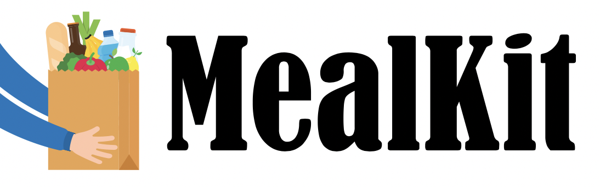
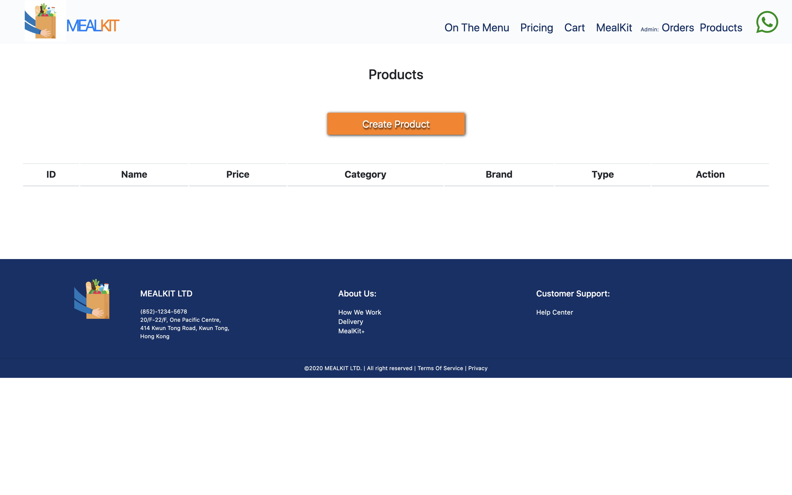
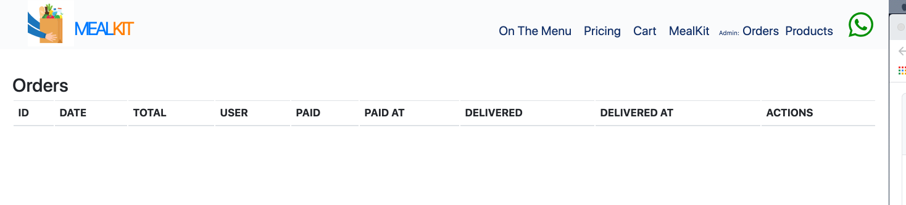
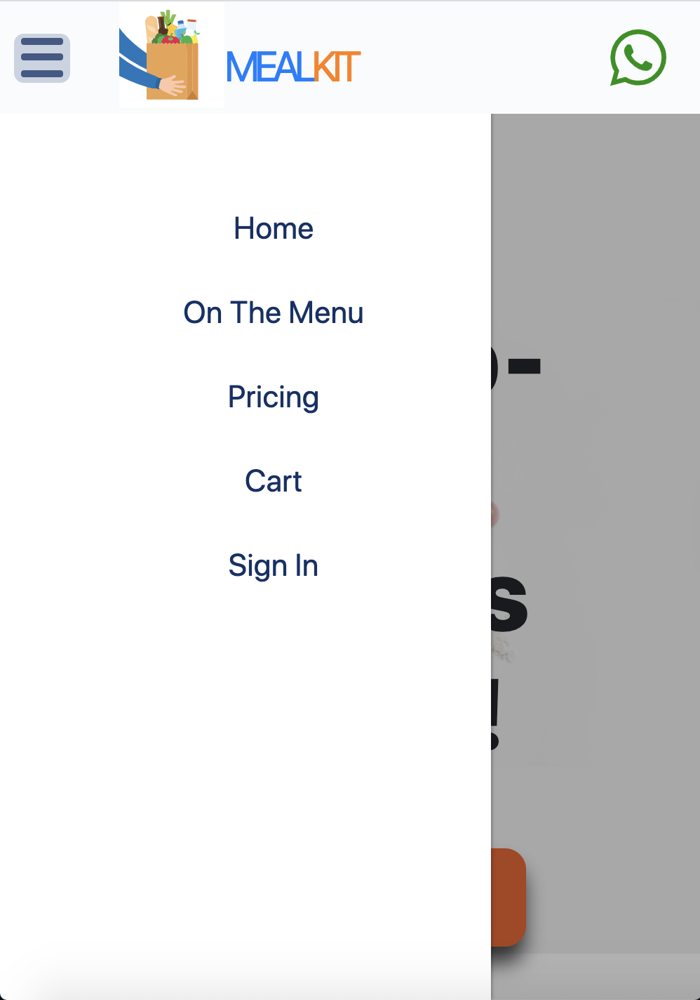
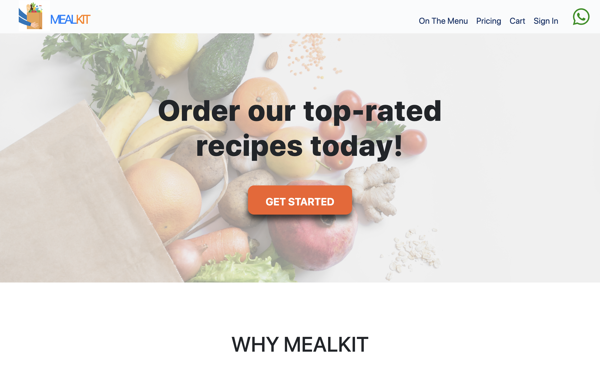
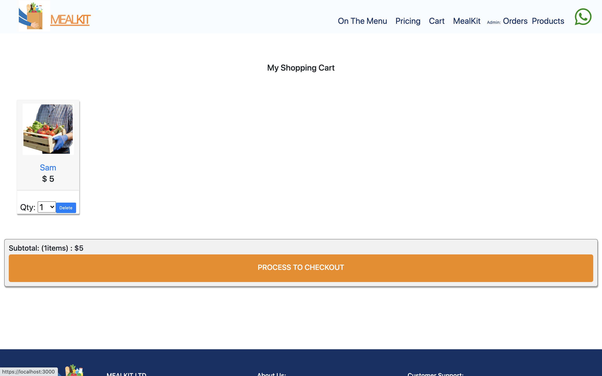
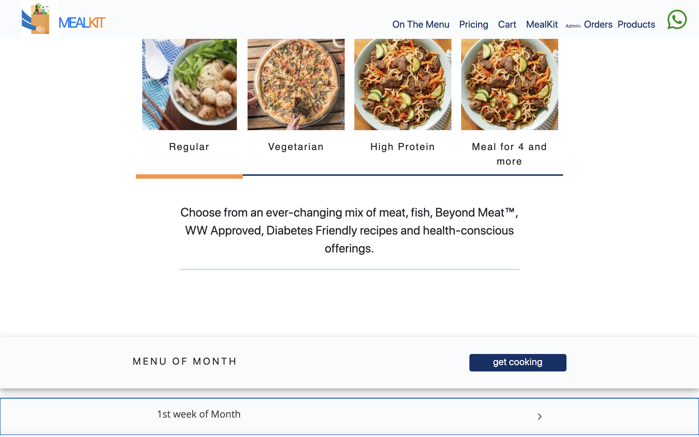

# MealKit



`MealKit` is a fully functional food with recipe delivery cart built the following coding language: React.js(Frondend), Node.js(Backend), Postgre(Database).

Payment provider:

- [Stripe](https://stripe.com/)

## Installation

1. Create a folder to hold your installation: `mkdir MealKit`
2. FTP/Copy the contents of the zip to your newly created folder
3. Enter folder: `cd MealKit`
4. Install dependencies: `npm install` or `yarn`
5. Start application: `npm start` or `yarn start`

## API

We use the following API to do the certain function we want for this app.

1. To let the admin person upload product images.
   Visit: [img.eservice-hk.net](https://img.eservice-hk.net/api.php?version=2)
2. To build payment by using API from `Stripe.com`
   Visit: [Stripe](https://stripe.com/docs/api)

## Admin

For the admin person in MealKit, admin have the authority to do the following:

1. Create products
   
2. Read orders record
   

## Styling

1. Navbar : Navbar here created with sidedrawer
   When using in Laptop screen, navbar will show all the component on the top of the screen;
   When using in mobile screen, most of the component will hide and toggle button appear. Then to switch page, we click the toggle button to click to the page we want.




2. Cart Page
   

3. Menu Page
   Menu page have weekly menu, the Card of dishes can access to the product which admin person created.



##### CSS

You can add your own custom CSS into the `index.css` or `[file name].css` file. This will be minified and added to each page.

##### Footer

You can add your own custom HTML footer which may have contact details, social media links etc into the `footer.css` file. This will be added to bottom of each page.

## Database

`MealKit` uses Postgres for storing all the data. Once you set up the database connection. Then for your backend folde  
 type : `knex imgration:latest` in your terminal for the database connection.

## Configuration

###### whatsapp

For the Whats app button with connect directly to whats app
To do it:

1. Create the navbar
2. Make an a tag, the href link it to phone number
   Example:
   `https://api.whatsapp.com/send?phone=(phone number )`
3. inside the a tag, use whats app button icon
4. Then it's good to go.

###### Stripe (Payments )

The Stripe config file is located: `StripeAPI.js` A example Stripe settings file is provided:

````
const stripeAPI = {
  createPaymentIntent,
  getPublicStripeKey: getPublicStripeKey,
  getProductDetails: getProductDetails
};```
````

## Built With 

- React.js: Font-end development
- Reactstrap: Font-end component
- React-bootstrap: Font-end component
- Postgres: Database structure
- DBeaver: Database
- Node.js: Backend development
- Sketch: For UX and pages structure
- Adobe
- Font Awesome icon